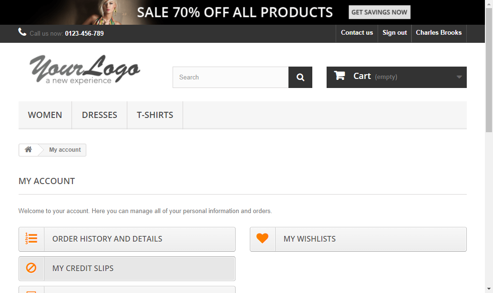

# Desafio-Prime-Hero

* Padrão Page Object Model (Design Pattern)
* Fluxo escolhido para automatizar: Cadastro de cliente
* Caso de teste 01: Cadastrar Cliente 
* Caso de teste 02: Cadastrar Cliente sem dados obrigatórios

---
#### Tradicional
**Caso de Teste 01: Cadastrar Cliente**
- Acessar pagina home do site
- Clicar no botão superior direito "Sign in"
- Inserir um e-mail válido
- Clicar no botão "Create an account"
- Preencher os campos obrigatórios
- Clicar em "Register" para finalizar o cadastro
- Conferir mensagem "Welcome to your account. Here you can manage all of your personal information and orders."

**Caso de teste 2: Cadastrar Cliente**
- Acessar pagina home do site
- Clicar no botão superior direito "Sign in"
- Inserir um e-mail válido
- Clicar no botão "Create an account"
- Preencher os campos obrigatórios
- Clicar em "Register" para finalizar o cadastro
- Conferir mensagem "Welcome to your account. Here you can manage your personal information and orders."
---

---

#### BDD - Behaviour Driven Development
**Caso de Teste 01: Cadastrar Cliente**
- Dado que estou na página home do site
- Quando eu clicar no botão "Sign in"
    - E inserir um e-mail válido
    - E clicar no botão "Create an account"
    - E preencher os campos obrigatórios
    - E clicar em "register" para finalizar o - cadastro
- Então devo ver a mensagem "Welcome to your  account. Here you can manage all of your - personal information and orders."

**Caso de teste 2: Cadastrar Cliente**
- Dado que estou na página home do site
- Quando eu clicar no botão "Sign in"
    - E inserir um e-mail válido
    - E clicar no botão "Create an account"
    - E preencher os campos obrigatórios
    - E clicar em "register" para finalizar o - cadastro
- Então devo ver a mensagem "Welcome to your account. Here you can manage your personal information and orders."

---
**Caso fosse necessário reportar uma falha para o Caso de teste 2**

**Report - 01**
**Titulo**: Falha detectada na mensagem de boas vindas na tela "MyAccount"

 > Falha detectada na mensagem de boas vindas *"Welcome to your account. Here you can manage your personal information and orders."* após efetuar login e ser redirecionado para a página "MyAccount"

**Passo a passo:**
- Dado que estou na página home do site
- Quando eu clicar no botão "Sign in"
    - E inserir um e-mail válido
    - E clicar no botão "Create an account"
    - E preencher os campos obrigatórios
    - E clicar em "register" para finalizar o - cadastro
- Então devo ver a mensagem "Welcome to your account. Here you can manage your personal information and orders."

**Evidência**:
